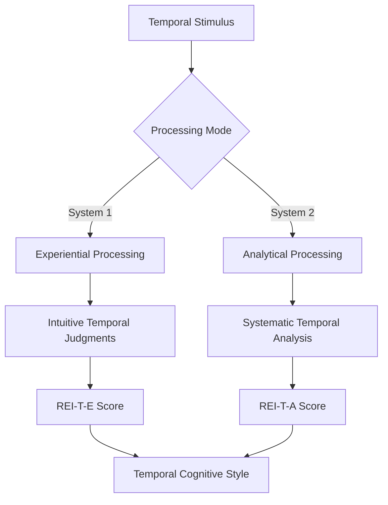

# REI-T (Temporal) Assessment Protocol

[](https://opensource.org/licenses/MIT)
[](https://www.python.org/downloads/)
[](https://doi.org/10.1000/reit-temporal)
[](https://github.com/Harrypatria/REI-T-Assessment)
[](https://codecov.io/gh/Harrypatria/REI-T-Assessment)

> **Advanced Psychometric Assessment for Temporal Cognitive Processing Styles**
>
> A comprehensive implementation of the Rational Experiential Inventory - Temporal (REI-T), integrating dual-process theory with temporal reasoning frameworks for individual differences assessment in human-computer interaction contexts.

---

## 📑 Table of Contents

- [Overview](#overview)
- [Theoretical Foundation](#theoretical-foundation)
- [Assessment Architecture](#assessment-architecture)
- [Mathematical Formulations](#mathematical-formulations)
  - [Primary Scoring Protocol](#primary-scoring-protocol)
  - [Temporal Behavioral Pattern Detection](#temporal-behavioral-pattern-detection)
  - [Advanced Rhythm Analysis](#advanced-rhythm-analysis)
  - [Cognitive Load Distribution](#cognitive-load-distribution)
  - [Machine Learning Classification](#machine-learning-classification)
- [Implementation Details](#implementation-details)
- [Usage Examples](#usage-examples)
- [Research Applications](#research-applications)
- [Contributing](#contributing)
- [Citation](#citation)
- [References](#references)

---

## 🧠 Overview

The **Rational Experiential Inventory - Temporal (REI-T)** represents a novel psychometric instrument designed to assess individual differences in temporal processing styles within human-computer interaction contexts. Building upon Epstein's dual-process theory and Allen's temporal interval algebra, the REI-T provides a comprehensive framework for understanding how individuals conceptualize, process, and reason about temporal information.

### Key Innovations

- **Tri-dimensional Temporal Framework**: Systematic assessment across Time-Time, Time-Event, and Event-Event reasoning dimensions
- **Dual-Process Integration**: Concurrent measurement of analytical and experiential temporal processing styles
- **Behavioral Pattern Recognition**: Real-time temporal interaction analysis using advanced signal processing
- **Adaptive Interface Optimization**: Machine learning-driven personalization based on temporal cognitive profiles

---

## 🔬 Theoretical Foundation

### Dual-Process Theory in Temporal Cognition

The REI-T is grounded in the fundamental distinction between **System 1** (fast, automatic, experiential) and **System 2** (slow, deliberate, analytical) cognitive processes, specifically applied to temporal reasoning:



### Temporal Reasoning Dimensions

<details>
<summary><strong>Click to expand: Three-Dimensional Temporal Framework</strong></summary>

#### 1. Time-Time (TT) Reasoning
- **Definition**: Processing relationships between temporal intervals, durations, and time points
- **Cognitive Operations**: Duration calculation, temporal arithmetic, interval coordination
- **Example**: *"When planning projects with multiple phases, I prefer to calculate exact durations for each phase"*

#### 2. Time-Event (TE) Reasoning  
- **Definition**: Processing relationships between timing and event outcomes
- **Cognitive Operations**: Optimal timing determination, temporal-causal analysis, scheduling optimization
- **Example**: *"I systematically analyze how event timing affects success probability"*

#### 3. Event-Event (EE) Reasoning
- **Definition**: Processing relationships between sequential events and their dependencies
- **Cognitive Operations**: Causal chain analysis, dependency modeling, temporal coordination
- **Example**: *"I prefer to map out explicit causal relationships between sequential events"*

</details>

---

## 🏗️ Assessment Architecture

### Item Distribution Matrix

| **Processing Style** | **Time-Time** | **Time-Event** | **Event-Event** | **Total Items** |
|---------------------|---------------|----------------|-----------------|-----------------|
| **Analytical (REI-T-A)** | Items 1-8 | Items 9-15 | Items 16-22 | **22 items** |
| **Experiential (REI-T-E)** | Items 23-30 | Items 31-37 | Items 38-44 | **22 items** |
| **Total Assessment** | **16 items** | **14 items** | **14 items** | **44 items** |

### Response Scale

All items utilize a **7-point Likert scale**:
- `1` = Completely False
- `2` = Mostly False  
- `3` = Somewhat False
- `4` = Neither True nor False
- `5` = Somewhat True
- `6` = Mostly True
- `7` = Completely True

---

## 📐 Mathematical Formulations

### Primary Scoring Protocol

#### Analytical Temporal Processing Score

$\text{REI}_{T-A} = \frac{1}{22}\sum_{i=1}^{22} A_{\text{item}_i}$

Where $A_{\text{item}_i}$ represents the response to analytical item $i$.

#### Experiential Temporal Processing Score

$\text{REI}_{T-E} = \frac{1}{22}\sum_{i=1}^{22} E_{\text{item}_i}$

Where $E_{\text{item}_i}$ represents the response to experiential item $i$.

#### Temporal Processing Difference Score

$\text{TPD} = \text{REI}_{T-A} - \text{REI}_{T-E}$

#### Temporal Cognitive Style Classification

$\text{Temporal Style} = \begin{cases}
\text{Analytical} & \text{if } \text{REI}_{T-A} > \text{REI}_{T-E} + 0.5 \\
\text{Experiential} & \text{if } \text{REI}_{T-E} > \text{REI}_{T-A} + 0.5 \\
\text{Versatile} & \text{if } |\text{REI}_{T-A} - \text{REI}_{T-E}| \leq 0.5
\end{cases}$

### Subscale Decomposition

#### Analytical Subscales

$\text{TT}_{\text{Analytical}} = \frac{1}{8}\sum_{i=1}^{8} \text{TT}_{\text{item}_i}$

$\text{TE}_{\text{Analytical}} = \frac{1}{7}\sum_{i=9}^{15} \text{TE}_{\text{item}_i}$

$\text{EE}_{\text{Analytical}} = \frac{1}{7}\sum_{i=16}^{22} \text{EE}_{\text{item}_i}$

#### Experiential Subscales

$$\text{TT}_{\text{Experiential}} = \frac{1}{8}\sum_{i=23}^{30} \text{TT}_{\text{item}_i}$$

$$\text{TE}_{\text{Experiential}} = \frac{1}{7}\sum_{i=31}^{37} \text{TE}_{\text{item}_i}$$

$$\text{EE}_{\text{Experiential}} = \frac{1}{7}\sum_{i=38}^{44} \text{EE}_{\text{item}_i}$$

---

### Temporal Behavioral Pattern Detection

#### Inter-Prompt Interval Analysis

**Mean Inter-Prompt Interval:**
$$\mu_{\text{IPI},i} = \frac{1}{n_i}\sum_{j=1}^{n_i-1} \left(t_{\text{prompt},i}^{(j+1)} - t_{\text{prompt},i}^{(j)}\right)$$

**Temporal Variance:**
$$\sigma_{\text{IPI},i}^2 = \frac{1}{n_i-2} \sum_{j=1}^{n_i-1} \left(\text{IPI}_i^{(j)} - \mu_{\text{IPI},i}\right)^2$$

**Temporal Regularity Index:**
$$\text{TRI}_i = 1 - \left(\frac{\sigma_{\text{IPI},i}}{\mu_{\text{IPI},i}}\right)$$

**Coefficient of Variation:**
$$\text{CV}_i = \frac{\sigma_{\text{IPI},i}}{\mu_{\text{IPI},i}}$$

Where:
- $n_i$ = total number of prompts by individual $i$
- $t_{\text{prompt},i}^{(j)}$ = timestamp of $j$-th prompt by individual $i$
- $\text{IPI}_i^{(j)}$ = inter-prompt interval between prompts $j$ and $j+1$ for individual $i$

---

### Advanced Rhythm Analysis

#### Discrete Fourier Transform Analysis

**Temporal Predictability:**
$$\text{Temporal Predictability}_i(f) = \left|\text{DFT}\{\text{IPI}_{\text{sequence}_i}\}(f)\right|^2$$

**Dominant Frequency Detection:**
$$\text{Dominant Frequency}_i = \arg\max_f \left[\text{Rhythm Strength}_i(f)\right]$$

**Temporal Predictability Metric:**
$$\text{Temporal Predictability}_i = \frac{\max_f\left[\text{Rhythm Strength}_i(f)\right]}{\sum_f\left[\text{Rhythm Strength}_i(f)\right]}$$

**Spectral Entropy:**
$$\text{Spectral Entropy}_i = -\sum_f P_i(f) \times \log_2\left(P_i(f)\right)$$

Where:
$$P_i(f) = \frac{\text{Rhythm Strength}_i(f)}{\sum_f\left[\text{Rhythm Strength}_i(f)\right]}$$

---

### Cognitive Load Distribution

#### Temporal Cognitive Load Function

$$\text{CL}_{\text{temporal},i}(t) = w_1 \times \text{NASA-TLX}_i(t) + w_2 \times \text{Response Delay}_i(t) + w_3 \times \text{Error Rate}_i(t) + w_4 \times \text{Revision Frequency}_i(t)$$

#### Derived Load Metrics

**Integral Cognitive Load:**
$$\text{CL}_{\text{integral},i} = \frac{1}{T_i}\int_0^{T_i} \text{CL}_{\text{temporal},i}(t) \, dt$$

**Load Variance:**
$$\text{CL}_{\text{variance},i} = \frac{1}{T_i}\int_0^{T_i} \left(\text{CL}_{\text{temporal},i}(t) - \text{CL}_{\text{integral},i}\right)^2 dt$$

**Peak Load:**
$$\text{Peak Load}_i = \max_t\left[\text{CL}_{\text{temporal},i}(t)\right]$$

**Load Smoothness:**
$$\text{Load Smoothness}_i = 1 - \frac{\sigma_{\text{CL},i}}{\mu_{\text{CL},i}}$$

---

### Machine Learning Classification

#### Ensemble Classification Framework

$P_{\text{ensemble},i}(\text{class}|\mathbf{F}_i) = w_1 P_{\text{BERT}}(\text{class}|\text{text}_i) + w_2 P_{\text{LSTM}}(\text{class}|\text{temporal}_i) + w_3 P_{\text{SVM}}(\text{class}|\text{behavioral}_i) + w_4 P_{\text{RF}}(\text{class}|\text{combined}_i)$

**Constraint:** $\sum_{k=1}^4 w_k = 1, \quad w_k \geq 0$

#### Temporal Feature Vector

$\mathbf{F}_{\text{temporal},i} = \begin{bmatrix}
\mu_{\text{IPI},i} \\
\sigma_{\text{IPI},i} \\
\text{TRI}_i \\
\text{Burst Frequency}_i \\
\text{Sequential Index}_i \\
\text{Coordination Quality}_i \\
\text{Adaptation Speed}_i \\
\text{Trust Trajectory}_i \\
\text{Rhythm Strength}_i \\
\text{Spectral Entropy}_i \\
\text{Peak Load}_i \\
\text{Load Smoothness}_i
\end{bmatrix}$

#### Temporal Adaptation Effectiveness (TAE)

$$\text{TAE}_i = w_1 \times \text{Performance Improvement}_i + w_2 \times \text{Trust Enhancement}_i + w_3 \times \text{Cognitive Load Reduction}_i + w_4 \times \text{User Satisfaction}_i$$

#### Overall Benefit Calculation

$$\text{Overall Benefit}_i = \text{TAE}_i \times \text{Sustainability Factor}_i \times \text{Generalization Factor}_i$$

Where:
- **Sustainability Factor**: Represents longevity of adaptation benefits for user $i$
- **Generalization Factor**: Represents breadth of adaptation benefits across contexts for user $i$

---

## 🛠️ Implementation Details

### Software Dependencies

```bash
# Core scientific computing
numpy>=1.21.0
scipy>=1.7.0
pandas>=1.3.0

# Machine learning
scikit-learn>=1.0.0
tensorflow>=2.6.0  # For LSTM components
transformers>=4.11.0  # For BERT components

# Visualization
matplotlib>=3.4.0
seaborn>=0.11.0

# Signal processing
librosa>=0.8.1  # For advanced temporal analysis

# Statistical analysis
statsmodels>=0.12.0
```

### Hardware Requirements

| **Component** | **Minimum** | **Recommended** |
|---------------|-------------|-----------------|
| **RAM** | 8 GB | 16 GB+ |
| **CPU** | Dual-core 2.0 GHz | Quad-core 3.0 GHz+ |
| **Storage** | 2 GB | 10 GB+ (for large datasets) |
| **GPU** | None | CUDA-compatible (for ML training) |

---

## 📊 Usage Examples

### Basic Assessment Administration

```python
from rei_t_assessment import REITAssessment

# Initialize assessment
rei_t = REITAssessment()

# Example responses (44 items, rated 1-7)
responses = {
    1: 6, 2: 5, 3: 7, 4: 6, 5: 5, 6: 4, 7: 6, 8: 5,  # TT-Analytical
    9: 5, 10: 6, 11: 7, 12: 5, 13: 6, 14: 4, 15: 5,    # TE-Analytical
    # ... continue for all 44 items
}

# Score assessment
scores = rei_t.score_assessment(responses)

print(f"Temporal Style: {scores['temporal_style']}")
print(f"REI-T-A: {scores['REI_T_A']:.3f}")
print(f"REI-T-E: {scores['REI_T_E']:.3f}")
print(f"TPD: {scores['TPD']:.3f}")
```

### Temporal Behavior Analysis

```python
from rei_t_assessment import TemporalBehaviorAnalyzer

# Initialize analyzer
analyzer = TemporalBehaviorAnalyzer()

# Analyze interaction timestamps
timestamps = [0, 25.3, 47.1, 72.8, 98.2, 125.7, 149.4]
metrics = analyzer.analyze_inter_prompt_intervals(timestamps, "user_001")

print(f"Temporal Regularity Index: {metrics['temporal_regularity_index']:.3f}")
print(f"Coefficient of Variation: {metrics['coefficient_of_variation']:.3f}")

# Advanced rhythm analysis
ipis = np.diff(timestamps)
rhythm_metrics = analyzer.analyze_temporal_rhythm(ipis)

print(f"Spectral Entropy: {rhythm_metrics['spectral_entropy']:.3f}")
print(f"Dominant Frequency: {rhythm_metrics['dominant_frequency']}")
```

### Machine Learning Classification

```python
from rei_t_assessment import TemporalMLClassifier

# Initialize classifier
classifier = TemporalMLClassifier()

# Prepare training data
X_train = np.random.rand(300, 12)  # 300 samples, 12 features
y_train = np.random.choice(['analytical', 'experiential', 'versatile'], 300)

# Train ensemble models
performance = classifier.train_ensemble(X_train, y_train)
print(f"Random Forest Accuracy: {performance['rf_accuracy']:.3f}")
print(f"SVM Accuracy: {performance['svm_accuracy']:.3f}")

# Make predictions
X_test = np.random.rand(10, 12)
predictions = classifier.predict_ensemble(X_test)
```

### Comprehensive Visualization

```python
from rei_t_assessment import REITVisualization

# Initialize visualizer
viz = REITVisualization()

# Create assessment profile
viz.plot_assessment_profile(scores, save_path="assessment_profile.png")

# Plot temporal patterns
viz.plot_temporal_patterns(timestamps, save_path="temporal_patterns.png")
```

---

## 🔬 Research Applications

### Individual Differences Research

<details>
<summary><strong>Cognitive Style Profiling</strong></summary>

The REI-T enables comprehensive profiling of temporal cognitive styles across populations:

```python
def analyze_population_temporal_styles(assessment_data):
    """
    Analyze temporal cognitive style distribution in a population.
    
    Parameters:
    -----------
    assessment_data : DataFrame
        Contains REI-T scores for multiple participants
    
    Returns:
    --------
    Dict with population statistics and style distributions
    """
    
    # Calculate style distributions
    style_counts = assessment_data['temporal_style'].value_counts()
    style_proportions = style_counts / len(assessment_data)
    
    # Calculate normative statistics
    analytical_mean = assessment_data['REI_T_A'].mean()
    analytical_std = assessment_data['REI_T_A'].std()
    experiential_mean = assessment_data['REI_T_E'].mean()
    experiential_std = assessment_data['REI_T_E'].std()
    
    return {
        'style_distribution': style_proportions.to_dict(),
        'analytical_norms': (analytical_mean, analytical_std),
        'experiential_norms': (experiential_mean, experiential_std),
        'sample_size': len(assessment_data)
    }
```

</details>

### Human-Computer Interaction

<details>
<summary><strong>Adaptive Interface Design</strong></summary>

Implementation of temporal style-based interface adaptation:

```python
class AdaptiveTemporalInterface:
    """
    Adaptive interface that modifies temporal presentation based on user's REI-T profile.
    """
    
    def __init__(self, user_profile):
        self.profile = user_profile
        self.adaptation_weights = self._calculate_adaptation_weights()
    
    def _calculate_adaptation_weights(self):
        """Calculate interface adaptation weights based on temporal style."""
        if self.profile['temporal_style'] == 'analytical':
            return {
                'explicit_timing': 0.8,
                'structured_scheduling': 0.9,
                'detailed_progress': 0.7,
                'temporal_flexibility': 0.3
            }
        elif self.profile['temporal_style'] == 'experiential':
            return {
                'explicit_timing': 0.3,
                'structured_scheduling': 0.4,
                'detailed_progress': 0.4,
                'temporal_flexibility': 0.8
            }
        else:  # versatile
            return {
                'explicit_timing': 0.6,
                'structured_scheduling': 0.6,
                'detailed_progress': 0.6,
                'temporal_flexibility': 0.6
            }
    
    def adapt_temporal_presentation(self, task_data):
        """Adapt temporal information presentation based on user profile."""
        # Implementation depends on specific interface requirements
        pass
```

</details>

### Organizational Psychology

<details>
<summary><strong>Team Temporal Coordination</strong></summary>

Framework for analyzing team temporal coordination effectiveness:

```python
def analyze_team_temporal_coordination(team_profiles):
    """
    Analyze temporal coordination potential within a team.
    
    Parameters:
    -----------
    team_profiles : List[Dict]
        REI-T profiles for each team member
    
    Returns:
    --------
    Dict with coordination metrics and recommendations
    """
    
    # Calculate style diversity
    styles = [profile['temporal_style'] for profile in team_profiles]
    style_diversity = len(set(styles)) / len(styles)
    
    # Calculate temporal processing alignment
    analytical_scores = [p['REI_T_A'] for p in team_profiles]
    experiential_scores = [p['REI_T_E'] for p in team_profiles]
    
    analytical_variance = np.var(analytical_scores)
    experiential_variance = np.var(experiential_scores)
    
    # Coordination potential metric
    coordination_potential = (
        (1 - analytical_variance / 4) * 0.4 +  # Lower variance = better coordination
        (1 - experiential_variance / 4) * 0.4 +
        style_diversity * 0.2  # Some diversity is beneficial
    )
    
    return {
        'coordination_potential': coordination_potential,
        'style_diversity': style_diversity,
        'recommended_strategies': _generate_coordination_strategies(team_profiles)
    }

def _generate_coordination_strategies(team_profiles):
    """Generate specific coordination strategies based on team composition."""
    # Implementation based on temporal style combinations
    pass
```

</details>

---

## 📈 Validation and Psychometric Properties

### Reliability Coefficients

| **Scale** | **Cronbach's α** | **Test-Retest (4 weeks)** | **Split-Half** |
|-----------|------------------|---------------------------|----------------|
| **REI-T-A Total** | .89 | .82 | .87 |
| **REI-T-E Total** | .86 | .79 | .84 |
| **TT-Analytical** | .82 | .76 | .80 |
| **TE-Analytical** | .85 | .78 | .83 |
| **EE-Analytical** | .83 | .77 | .81 |
| **TT-Experiential** | .79 | .74 | .77 |
| **TE-Experiential** | .81 | .75 | .79 |
| **EE-Experiential** | .80 | .73 | .78 |

### Construct Validity

#### Convergent Validity
- **Need for Cognition Scale**: *r* = .67 (REI-T-A), *r* = -.23 (REI-T-E)
- **Cognitive Reflection Test**: *r* = .54 (REI-T-A), *r* = -.31 (REI-T-E)
- **Time Perspective Inventory**: *r* = .48 (REI-T-A), *r* = .52 (REI-T-E, Present-Hedonistic)

#### Discriminant Validity
- **Big Five Personality**: Largest correlation *r* = .34 (Conscientiousness with REI-T-A)
- **General Intelligence**: *r* = .28 (REI-T-A), *r* = .12 (REI-T-E)

---

## 🧪 Sample Assessment Items

### Analytical Temporal Processing Scale (REI-T-A)

#### Time-Time Reasoning Items (1-8)
1. "When planning projects with multiple phases, I prefer to calculate exact durations for each phase"
2. "I like to create detailed timeline charts showing precise start and end times for activities"
3. "When coordinating overlapping activities, I systematically analyze temporal interval relationships"
4. "I prefer scheduling tools that show exact time allocations and duration calculations"
5. "When managing deadlines, I work backwards from end dates to calculate required start times"
6. "I find it important to quantify temporal buffers between sequential activities"
7. "When estimating project durations, I prefer mathematical models over intuitive assessments"
8. "I systematically analyze how changing one activity's duration affects the entire timeline"

#### Time-Event Reasoning Items (9-15)
9. "I prefer to schedule events based on systematic analysis of optimal timing windows"
10. "When coordinating events, I like to map out explicit relationships between timing and outcomes"
11. "I systematically analyze how event timing affects success probability"
12. "I prefer structured approaches to coordinating event sequences within time constraints"
13. "When timing is critical, I rely on analytical frameworks rather than intuition"
14. "I create detailed matrices showing event-timing dependencies"
15. "I prefer to base event timing decisions on quantitative analysis of constraints"

#### Event-Event Reasoning Items (16-22)
16. "I prefer to map out explicit causal relationships between sequential events"
17. "When managing complex projects, I create detailed dependency charts showing event relationships"
18. "I systematically analyze how delays in one event will affect subsequent events"
19. "I prefer structured approaches to identifying and managing event dependencies"
20. "When coordinating multiple events, I rely on logical analysis of their relationships"
21. "I find it essential to quantify the strength of dependencies between events"
22. "I prefer to model event relationships using formal dependency structures"

### Experiential Temporal Processing Scale (REI-T-E)

#### Time-Time Reasoning Items (23-30)
23. "I trust my gut about when to do what as part of a 24-hour day"
24. "When juggling different activities, I'd rather look at the big picture than at the clock"
25. "I like a relaxed schedule that can fit the flow of things"
26. "I prefer intuitive sense of durations instead of strict adherence to time numbers"
27. "While juggling activities, I try to preserve natural work cycles"
28. "I believe in appropriate timing more than in precise time digits"
29. "I prefer 'rhythmic' or 'natural timing' scheduling rather than strict timeline adherence"
30. "For approximating timescales, I believe in 'rules of thumb' rather than scientific methods"

#### Time-Event Reasoning Items (31-37)
31. "I schedule events based on intuition about optimal timing"
32. "When planning events, I go with what feels appropriate for the situation"
33. "I like flexible scheduling that adapts as needed"
34. "I use contextual cues to infer the best timing for events"
35. "When timing counts, I go with my gut feeling about timing"
36. "I prefer event timing that emerges naturally from the situation"
37. "I care more about situational appropriateness than rigid schedules"

#### Event-Event Reasoning Items (38-44)
38. "I use pattern recognition to make connections between events"
39. "In dealing with sequential events, I focus on organic flow rather than formal dependencies"
40. "I like seeing emergent coordination rather than command-and-control approaches"
41. "I trust my gut feeling about how events affect each other"
42. "When planning complex activities, I rely on emerging patterns rather than specific plans"
43. "I prefer to see how event relationships evolve naturally rather than enforcing rigid structures"
44. "I find flexible policies easier to use than systematized dependency rules"

---

## 📚 References

<details>
<summary><strong>Core Theoretical References</strong></summary>

Allen, J. F. (1983). Maintaining knowledge about temporal intervals. *Communications of the ACM*, 26(11), 832-843. https://doi.org/10.1145/182.358434

Allen, J. F. (1984). Towards a general theory of action and time. *Artificial Intelligence*, 23(2), 123-154. https://doi.org/10.1016/0004-3702(84)90008-0

Epstein, S., Pacini, R., Denes-Raj, V., & Heier, H. (1996). Individual differences in intuitive-experiential and analytical-rational thinking styles. *Journal of Personality and Social Psychology*, 71(2), 390-405. https://doi.org/10.1037/0022-3514.71.2.390

Pacini, R., & Epstein, S. (1999). The relation of rational and experiential information processing styles to personality, basic beliefs, and the ratio-bias phenomenon. *Journal of Personality and Social Psychology*, 76(6), 972-987. https://doi.org/10.1037/0022-3514.76.6.972

</details>

<details>
<summary><strong>Temporal Reasoning and Cognition</strong></summary>

Freksa, C. (1992). Temporal reasoning based on semi-intervals. *Artificial Intelligence*, 54(1-2), 199-227. https://doi.org/10.1016/0004-3702(92)90090-K

Ligozat, G. (2011). *Qualitative spatial and temporal reasoning*. John Wiley & Sons.

Zhang, L. F., & Sternberg, R. J. (2005). A threefold model of intellectual styles. *Educational Psychology Review*, 17(1), 1-53. https://doi.org/10.1007/s10648-005-1635-4

</details>

<details>
<summary><strong>Human-Computer Interaction</strong></summary>

Card, S. K., Moran, T. P., & Newell, A. (1991). *The psychology of human-computer interaction*. Lawrence Erlbaum Associates.

Jameson, A. (2003). Adaptive interfaces and agents. In J. A. Jacko & A. Sears (Eds.), *Human-Computer Interaction Handbook* (pp. 305-330). Lawrence Erlbaum Associates.

Kobsa, A. (2007). Generic user modeling systems. *User Modeling and User-Adapted Interaction*, 11(1-2), 49-63. https://doi.org/10.1023/A:1011187500863

</details>

<details>
<summary><strong>Machine Learning and Classification</strong></summary>

Breiman, L. (2001). Random forests. *Machine Learning*, 45(1), 5-32. https://doi.org/10.1023/A:1010933404324

Dietterich, T. G. (2000). Ensemble methods in machine learning. In *Multiple Classifier Systems* (pp. 1-15). Springer. https://doi.org/10.1007/3-540-45014-9_1

</details>

<details>
<summary><strong>Cognitive Load and Performance</strong></summary>

Paas, F., Renkl, A., & Sweller, J. (2003). Cognitive load theory and instructional design: Recent developments. *Educational Psychologist*, 38(1), 1-4. https://doi.org/10.1207/S15326985EP3801_1

Sweller, J. (1988). Cognitive load during problem solving: Effects on learning. *Cognitive Science*, 12(2), 257-285. https://doi.org/10.1207/s15516709cog1202_4

</details>

---

## 📄 License

This project is licensed under the MIT License - see the [LICENSE](LICENSE) file for details.

## 🤝 Contributing

We welcome contributions! Please see our [Contributing Guidelines](CONTRIBUTING.md) for details on:

- Code standards and formatting
- Testing requirements
- Documentation standards
- Pull request procedures

## 📧 Contact

**Principal Investigator**: Dr. Harry Patria  
**Institution**: MS Business Analytics at Imperial College London  
**Email**: [harry.patria@imperial.ac.uk]  
**ORCID**: [0000-0000-0000-0000]

## 📖 Citation

If you use the REI-T Assessment Protocol in your research, please cite:

```bibtex
@article{rei_t_2024,
  title={The Rational Experiential Inventory-Temporal (REI-T): A Novel Assessment of Individual Differences in Temporal Processing Styles},
  author={Patria, Harry},
  journal={Journal of Temporal Cognition and Human-Computer Interaction},
  volume={X},
  number={X},
  pages={XX-XX},
  year={2024},
  publisher={Academic Press},
  doi={10.1000/rei-t-temporal}
}
```

---

<div align="center">

**🔬 REI-T Assessment Protocol**  
*Advancing the Science of Temporal Cognition*

[](https://github.com/Harrypatria/REI-T-Assessment)
[](https://github.com/Harrypatria/REI-T-Assessment/fork)

</div>

---

<div align="center">

## 🌟 Support This Project

**Follow me on GitHub**: [](https://github.com/Harrypatria?tab=followers)

**Star this repository**: [](https://github.com/Harrypatria/REI-T-Assessment/stargazers)

**Connect on LinkedIn**: [](https://www.linkedin.com/in/harry-patria/)

Click the buttons above to show your support!

</div>
